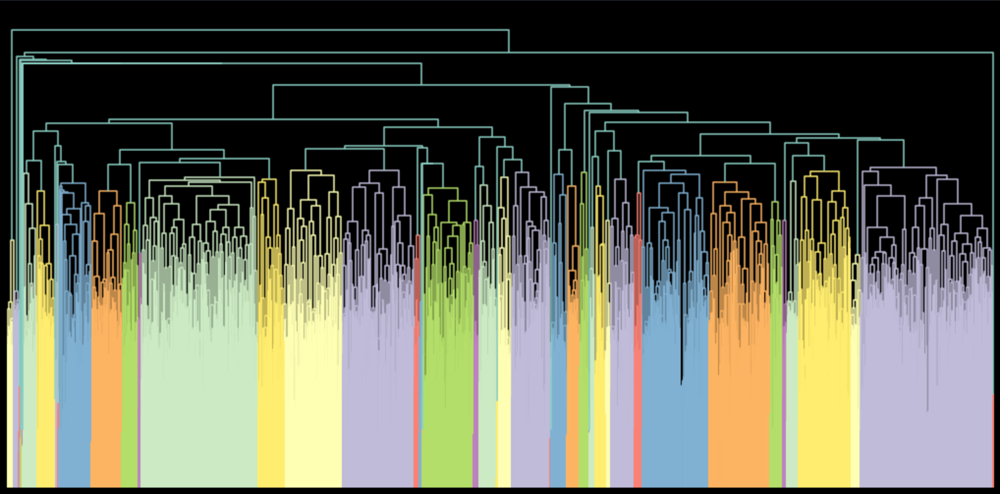

# Krakow

Well balanced hierarchical graph clustering.

It's based on the [Paris algorithm](https://github.com/tbonald/paris), with just a tiny modification to make the trees more balanced. It's useful for example when you try to choose some cluster by traversing the tree top-down. It operates on networkx graphs.

## Installation

```
pip install krakow
```

## Usage

```
from krakow import krakow

dendrogram = krakow(Graph)
```

`Graph` must be a networkx graph, and `dendrogram` is in a [linkage matrix](https://docs.scipy.org/doc/scipy/reference/generated/scipy.cluster.hierarchy.linkage.html#scipy.cluster.hierarchy.linkage) format. If you want to traverse the tree from top to down, it's useful to convert this linkage matrix into a tree with `scipy.cluster.hierarchy.to_tree`.

You can easily visualize dendrograms:
```
from krakow.utils import plot_dendrogram

plot_dendrogram(dendrogram)
```


## Balance comparison

Balance can be adjusted with the `balance` parameter. On default it's set to 2 (can be seen in the image above). When set to 1, the algorithm is identical to the Paris algorithm. The tree is clearly less balanced then:
```
dendrogram = krakow(Graph, balance=1)
plot_dendrogram(dendrogram)
```



For `balance=1.5`:


Any value >= 1 can be set, but enforcing a very high balance can harm the clustering quality.

# Math

The only difference from the Paris algorithm, is the definition of distance between clusters. In Paris (see equation 2 in [their paper](https://arxiv.org/pdf/1806.01664.pdf)), it's:

=\frac{p(a)p(b)}{p(a,b)})

Here, it's defined as:

=\frac{(p(a)p(b))^{balance}}{p(a,b)})

In effect, big clusters are treated as having more distance between them, so small clusters will be merged first. This leads to a more balanced tree.


TODO: prove that for balance > 1 algorithm is still reducible (which is necessary for correctness).

We can also experiment with other distance definitions (as long as they are reducible), and check which give the best balance while preserving clustering quality (which can be measured with `krakow.utils.normalized_dasgupta_cost`).
